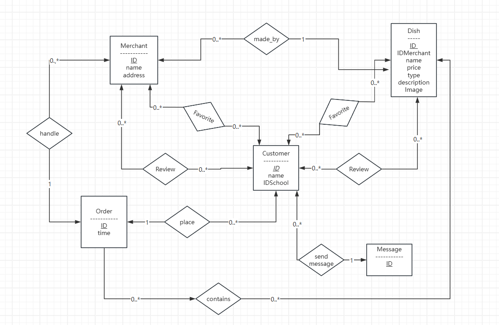
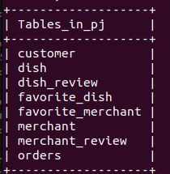
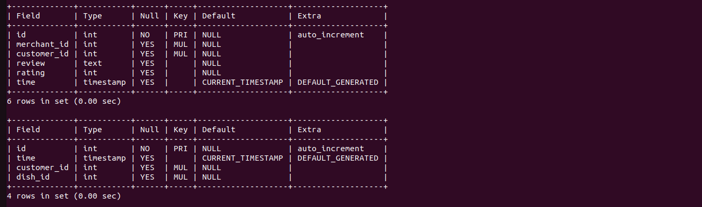

# 数据库PJ第一次提交

## 代码仓库地址

[ZeZeZa/Database-PJ (github.com)](https://github.com/ZeZeZa/Database-PJ)

## ERD

## 表结构

## 总览

## schema展示

## 已完成的内容

### 顾客、商户、管理员的登录

用户现可通过命令行输入姓名身份来登录应用并连接到数据库

### 表结构的建立与基本的工具类

在Creat.java中，我们在链接上数据库后利用Sq语句进行了基本的表结构建立。

